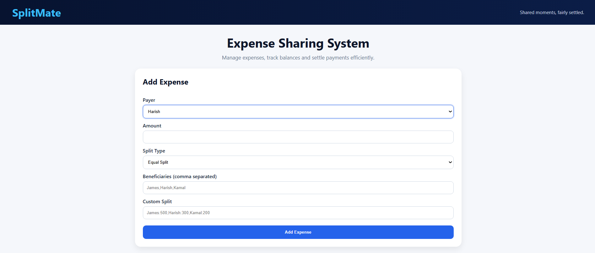
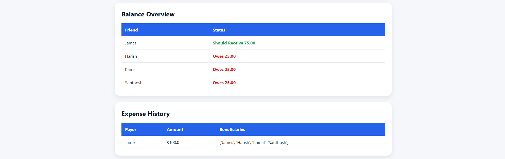

# SplitMate

### Shared moments, fairly settled.

SplitMate is a web-based Expense Sharing System developed using FastAPI, HTML, CSS, SQLite, and NumPy. It helps users manage shared expenses, track balances, calculate settlements, and visualize financial interactions within a group.

---

## Features

### Expense Management

- Add shared expenses
- Equal split among multiple users
- Custom split support
- Track expense history

### Balance Tracking

- Calculate individual balances
- Identify who owes money
- Identify who should receive money

### Settlement Suggestions

- Automatically generate optimized settlement transactions
- Reduce the number of payments required

### Analytics Dashboard

- Visualize balances using charts
- Easy-to-understand financial overview

### Modern UI

- Responsive design
- Clean dashboard interface
- Interactive tables and charts

---

## Technology Stack

### Backend

- FastAPI
- Python

### Frontend

- HTML
- CSS
- Jinja2 Templates

### Database

- SQLite

### Libraries Used

- NumPy
- Chart.js
- Uvicorn
- python-multipart

---

## Project Structure

```
SplitMate/
│
├── static/
│   └── style.css
│
├── templates/
│   └── index.html
│
├── screenshots/
│
├── database.py
├── expense_manager.py
├── main.py
├── models.py
│
├── data.db
├── requirements.txt
└── README.md
```

---

## Installation

### Clone the Repository

```bash
git clone https://github.com/jamesalwin1/splitmate-expense-sharing-web
cd SplitMate
```

### Install Dependencies

```bash
pip install -r requirements.txt
```

### Run the Application

```bash
python -m uvicorn main:app --reload
```

---

## Open in Browser

```text
http://127.0.0.1:8000
```

---

## Usage

### Add Expense

1. Select the payer.
2. Enter the amount.
3. Choose split type.
4. Enter beneficiaries.
5. Submit the expense.

### Equal Split

The total amount is equally divided among all beneficiaries.

### Custom Split

Specify custom amounts for each participant.

Example:

```text
James:500,Harish:300,Kamal:200
```

---

## Screenshots

### Dashboard


### Balance Overview


### Settlements and Analytics


---

## Sample Scenario

### Expense

James pays ₹100 for:

- James
- Harish
- Kamal
- Santhosh

### Result

Each person owes ₹25.

### Settlement

- Harish → James ₹25
- Kamal → James ₹25
- Santhosh → James ₹25

---

## Future Enhancements

- User Authentication
- Friend Management
- Dark Mode
- PDF Report Export
- Email Notifications
- Mobile Responsive Improvements
- Advanced Analytics

---

## Learning Outcomes

This project demonstrates:

- FastAPI Web Development
- SQLite Database Integration
- Expense Splitting Algorithms
- Settlement Optimization Logic
- Frontend Dashboard Design
- Data Visualization using Chart.js

---

## Author

James Alwin

SplitMate – Shared moments, fairly settled.
